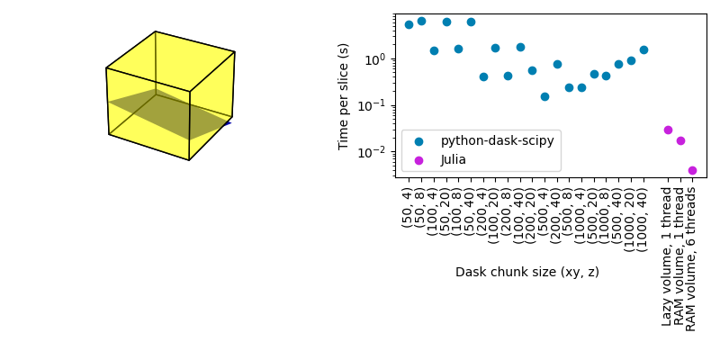
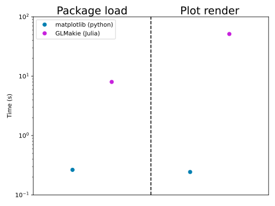
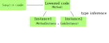
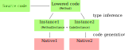
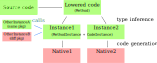
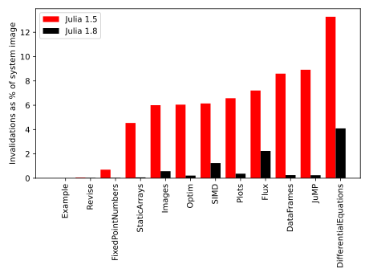
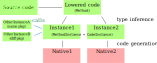

<style type="text/css">
p { text-align: left; }
</style>
# Improvements in package precompilation

Timothy E. Holy

Washington University in St. Louis

Valentin Churavy

Massachusetts Institute of Technology

---

### Julia runs fast


---

### You can write fast code quickly



- <!-- .element: class="fragment" data-fragment-index="1" --> Python's `dask.array`: ~12,000 lines of code
- Julia: 18 lines of code   <!-- .element: class="fragment" data-fragment-index="2" -->

---

### But Julia has a major usability problem: latency, aka Time To First eXecution (TTFX)


Julia:
```julia
using GLMakie
plot(rand(10))
```

Python: <!-- .element: class="fragment" data-fragment-index="1" -->

```python
import matplotlib.pyplot as plt
from numpy import random
plt.plot(random.rand(10))
```
<!-- .element: class="fragment" data-fragment-index="1" -->

---

### The two halves of TTFX

- package loading (a subject for a later day)
- code compilation (our current target)

---

### Strategies to reduce compilation time

- make the compiler faster
- compile as little as needed (LLVM compile-on-demand) <!-- .element: class="fragment" data-fragment-index="1" -->
- re-use the compiled code: better precompilation <!-- .element: class="fragment" data-fragment-index="2" -->

---

### Why precompilation is important



---

### What gets saved from Julia's compilation pipeline?


---

### What gets saved from Julia's compilation pipeline?



---

### What gets saved from Julia's compilation pipeline?



---

### What gets saved from Julia's compilation pipeline (Julia 1.0-1.7)?



---

### Challenges to more comprehensive precompilation: invalidation

Julia has to discard compiled code if it's no longer valid. How does this happen?

```julia
f(::Integer) = 1
g(x) = f(x)
g(1)         # compiles g(::Int) and f(::Int)
```

But now define

```julia
f(::Int) = 2
```

and the compiled code for `g(::Int)` has to be discarded (`f(::Int) from f(::Integer)` is no longer used).

---

### How common is invalidation?



Fewer invalidations => more benefit from precompilation

---

### What gets saved from Julia's compilation pipeline (Julia 1.8)?



---

### Some benchmarks


---

### Custom precompilation: `Startup.jl`

`~/.julia/config/startup.jl`:
```julia
using Startup
```

`~/.julia/dev/Startup/src/Startup.jl`:
```julia
module Startup
import Pkg1, Pkg2, Pkg3
Pkg1.somefunction(rand(10))    # force precompilation of `somefunction` and its dependents
⋮
end
```
---

### Comparing Startup.jl vs PackageCompiler

|           |  Startup.jl  |  PackageCompiler  |
|:---------:|:------------:|:-----------------:|
| Load time | **Poor** | **Good** |
| Inferred code saved | Yes† | Yes |
| Native code saved | **No** | **Yes** |
| Works with Pkg updates | **Yes** | **No** |

†Caveat: there's an exception for runtime dispatch (see SnoopCompile docs for details). Expected to be automatically fixable in Julia 1.9 and higher.

---

### Looking ahead: saving native code in package precompilation

Julia has two independent systems for storing code in files:

|       | `dump.c` | `staticdata.c` |
|:----- |:--------:|:--------------:|
| Lowered code | Yes | Yes |
| Type-inferred code | Yes | Yes |
| Native code | **No** | **Yes** |
| Usable for packages | **Yes** | **No** |

---

### What's needed to support packages in `staticdata.c`?

Work has started: see PR#44527

Missing "external linkage," the ability to link compiled code in one file against compiled code in a separate file.


---

### Challenges

- De-duplication: `PkgA.f(::Integer)` gets specialized as `f(::Int)` in *both* `PkgB` and `PkgC`, these two (identical) specializations must be merged.
- Invalidation: must check validity of compiled code upon loading

All this exists in `dump.c`, it's mostly a question of migrating it to `staticdata.c` and handling the corresponding issues for LLVM.

---

### Changes to the LLVM landscape

(Slides from Val)

---

### A hopeful future

Julia 1.8: less invalidation, more comprehensive precompilation than any prior Julia version

On the horizon: comprehensive precompilation of native code

Not yet started:
- improvements in load times
- tools for streamlining the ecosystem (e.g., de-duplication across packages)

---
